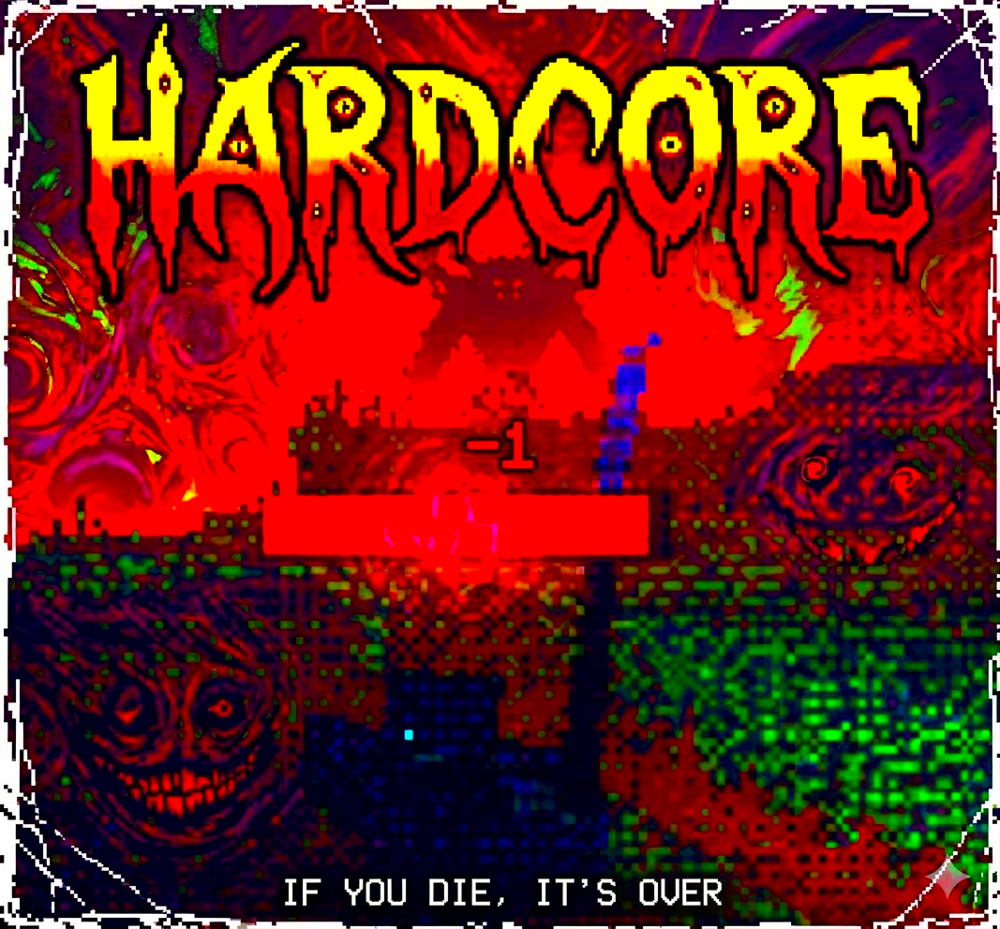

# HARDCORE

## Description

**HARDCORE** is a simple mod for **Lucid Blocks** that enables hardcore mode in worlds.
In other words: if you die, you really die. 

**Note:** This mod does not add extra difficulty to the game, it only disables respawn.


## Installation

1. Download the `.pck` file.
2. Place it inside a `mods` folder next to `lucid-blocks.exe`.

Example:

```
Lucid Blocks/
 ├ lucid-blocks.exe
 └ mods/
     └ hardcore.pck
```

3. Start the game. The mod will load automatically.

## Also try

[https://github.com/svidaniya/DreamersTitles](https://github.com/svidaniya/DreamersTitles) - Dreamers Titles is a simple mod for **Lucid Blocks** inspired by the Traveler's Titles Mod from Minecraft. It displays a title on the screen whenever you enter a new biome.
